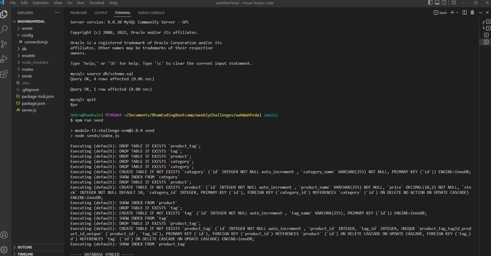
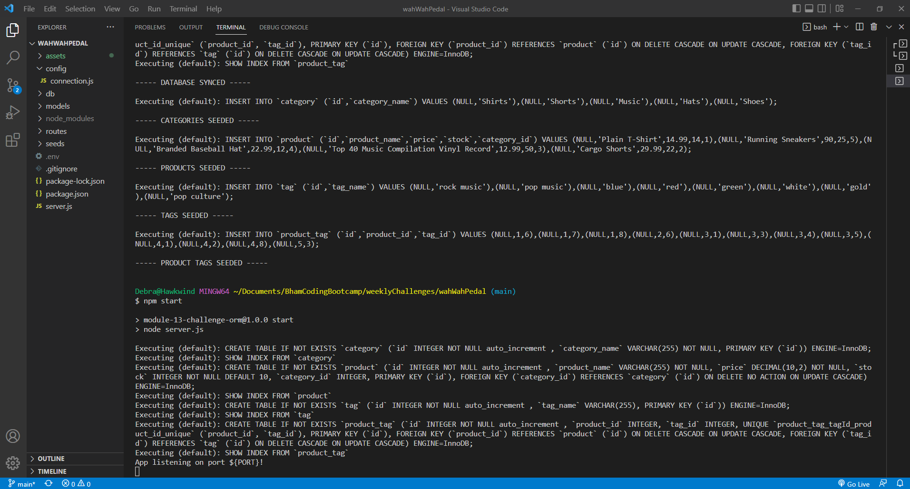
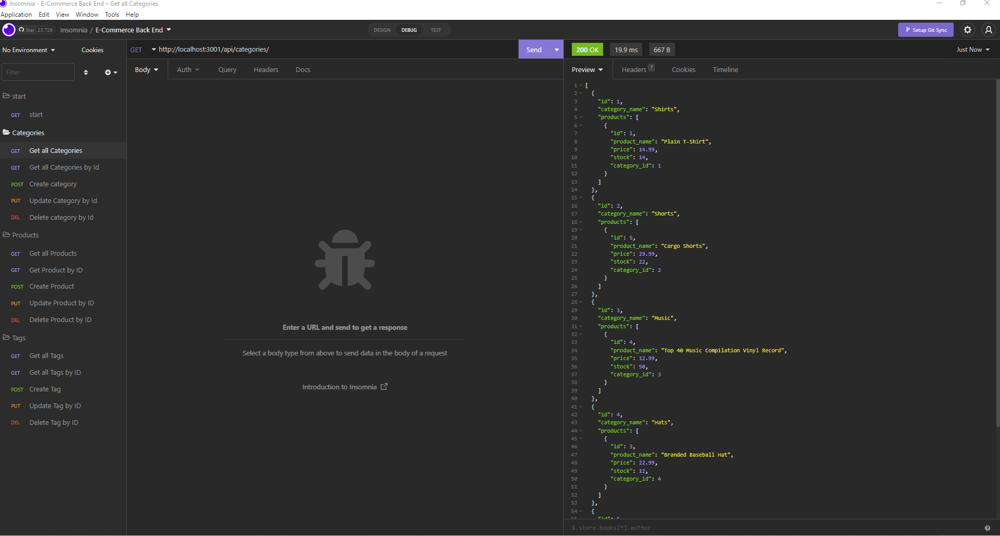
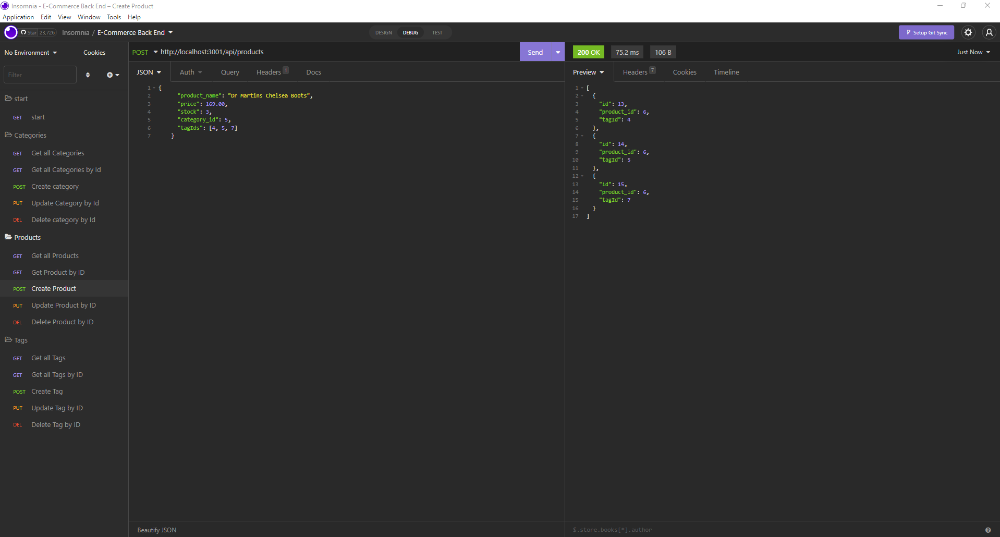

# E-Commerce Back End [](https://opensource.org/licenses/MIT)  
  
  ## Table of Contents  
  * [Description](#description)
  * [Installation](#installation)
  * [Usage](#usage)
  * [Walk Through Video](#walk-through-video)
  * [Screen Shots](#screen-shots)
  * [Tests](#tests)
  * [Technologies Used](#technologies-used)  
  * [Questions](#questions)
  * [How to Contribute](#How-to-Contribute)   
  * [License](#license)
  
  ## Description

  E-commerce, is the largest sector of the electronics industry, generating an estimated $29 trillion in 2019. Platforms like Shopify and WooCommerce provide a suite of e-commerce services to businesses of all sizes.  The motivation behind this project was to understand the fundamental architecture of these platforms through building the back end for an e-commerce website.

  The e-commerce back end developed in this project is a RESTful API that performs the standard create, read, update and delete (CRUD) operations.  The API is built on an Express JS server that  uses Sequelize as the ORM tool to interact with a MySQL database.  
  
       
  ### Functional Requirements

  The functional requirements that the E-commerce back end has been designed to meet, is defined by the user story and acceptance criteria listed below.  

  #### User Story

  ```md
AS A manager at an internet retail company
I WANT a back end for my e-commerce website that uses the latest technologies
SO THAT my company can compete with other e-commerce companies
```

 

#### Acceptance Criteria

```md
GIVEN a functional Express.js API
WHEN I add my database name, MySQL username, and MySQL password to an environment variable file
THEN I am able to connect to a database using Sequelize
WHEN I enter schema and seed commands
THEN a development database is created and is seeded with test data
WHEN I enter the command to invoke the application
THEN my server is started and the Sequelize models are synced to the MySQL database
WHEN I open API GET routes in Insomnia for categories, products, or tags
THEN the data for each of these routes is displayed in a formatted JSON
WHEN I test API POST, PUT, and DELETE routes in Insomnia
THEN I am able to successfully create, update, and delete data in my database
```


  ## Installation
  
  Afer cloning the application follow the instructions below to install the application:

    
  Install dependancies:

       npm i

  In order to connect mySQL to the database you will need to create a .env file in the project root directory that includes the following code:

    DB_NAME='ecommerce_db'
    DB_USER='root'
    DB_PASSWORD=<'your password'>     

  

  ## Usage
  
  Before running the back end application you need to:

[1]  Create the database you by logging into MySQL: 
    
     -u root -p    (you will be promted to enter your mySQL password)

[2]  Run the schema to create the database:


    source db/schema.sql

[3] Enter the following command to exit MySQL:

    quit

[3] Run the seed files to populate the database with the sample data:

    npm run seed

To run the e-commerce application enter:

    npm start

 You can test the APIs  and perform  CRUD operations using  an API REST tool such as Insomnia or Postman (Insomnia was used in this project).

 Available API routes to test are (id = the number of the item):

 Categories:

- [Get] http://localhost:3001/api/categories/

- [Get] http://localhost:3001/api/categories/id

- [Post] http://localhost:3001/api/categories/

- [Put] http://localhost:3001/api/categories/id

- [delete] http://localhost:3001/api/categories/id

Products:

- [Get] http://localhost:3001/api/products/

- [Get] http://localhost:3001/api/products/id

- [Post] http://localhost:3001/api/products/

- [Put] http://localhost:3001/api/products/id

- [delete] http://localhost:3001/api/products/id

Tag:

- [Get] http://localhost:3001/api/tags/

- [Get] http://localhost:3001/api/tags/id

- [Post] http://localhost:3001/api/tags/

- [Put] http://localhost:3001/api/tags/id

- [delete] http://localhost:3001/api/tags/id


 ## Walk Through Video

   Click on the link below to view a walk-through video demonstrating the API routes of the e-commerce back end  application using Insomnia.

   - [Link to e-commerce back end  walk-through video](https://watch.screencastify.com/v/AMgmpWLRPlwIUEI923Pd)

   

  ## Screen Shots

  The following screen shot shows the database being created.

 


  The  screen shot below shows the database being seeded with sample data and conecting to the server.

  
  
The  screen shot below shows the API  catagories Get route being tested using Insomnia.

  

  The  screen shot below shows  the API Post route for products being tested using Insomnia.

  

  ## Tests
  No code tests have been implemented.

  ## Technologies Used
  - JavaScript
  - Node Js
  - MySQL
  - Sequelize
  - MySQL
  - Insomnia REST Client
  
    
 
  ## Questions
  If you have any questions regarding this project or contents of this repository, please contact me via:
  
  - email: dat826@gmail.com
  - GitHub: [Beanalini](https://github.com/Beanalini)  


  
  ## Contributing
  If you would like to contribute to this project you can contact me by email at dat826@gmail.com or through  GitHub account   @[Beanalini](https://github.com/Beanalini).
  

  ## License
  This project is covered under the MIT License  
  
  [](https://opensource.org/licenses/MIT) 
  